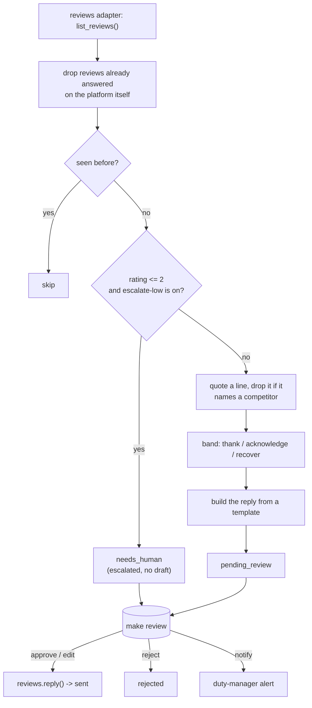

# Review-Response AI — "The Reputation Knight"

Watches Google, TripAdvisor, Booking.com, and Vrbo reviews and drafts a
personalised, on-brand reply to each that thanks the guest, addresses
complaints, and pulls in booking context.

Clone this repo, open Claude Code inside it, and your own Claude session sets
it up and runs it. It knows nothing about the company that built this
template — everything it needs is in this folder.

## What it does

**Does.** Watches Google, TripAdvisor, Booking.com, and Vrbo reviews and
drafts a personalised, on-brand reply to each that thanks the guest, addresses
complaints, and pulls in booking context. Flags angry reviews for a human.

**Won't.** Won't auto-publish negative-review replies without approval.

**Why.** Response rate and speed directly move ranking and conversion; nobody
has time to reply to them all.

**What to expect.** 100% review-response coverage within 24h; responded-to
listings convert higher.

**Roughly what it's worth.** +11% on listing conversion, in the source
material's own estimate. Treat that as directional, not a guarantee for your
property — see `docs/benefits.md` for how to measure your own numbers.

A note on the promise, up front, because this README will not repeat a claim
the code cannot back up: nothing here posts a reply to a real platform on its
own. Drafting is real and does the work described above. Posting — on any
platform, at any star rating — always needs a person to say yes first. See
"What it won't do" under Guardrails, and `docs/how-it-works.md` for why that
is true even after you switch this agent to `live` mode.

A note on language, up front too: every reply is drafted in **English only**,
whatever language the review itself is written in — there is no detection or
translation step. A French, German, or Japanese review still gets an English
draft, quoting the guest's own foreign-language line back verbatim. If a real
share of your guests write in another language, read "Adding a language"
under Customising before relying on this for guest-facing replies.

## Who it's for

A hotel, guesthouse, or restaurant that gets reviews on more than one
platform and does not have someone whose whole job is reputation management.
If review replies currently happen in bursts — a slow afternoon, a bad week
that finally prompts someone to catch up — this agent is for you. If you
already have a reputation-management subscription with its own AI reply
feature, this is a free, open alternative you run yourself, on your own
Claude Code subscription or API key, with the source code in front of you.

It assumes:

- You can get your reviews into a CSV (from your PMS, a review aggregator, or
  a platform's own export), or you are comfortable asking your Claude session
  to write a real adapter for a system you already use (`docs/integrations.md`).
- You have someone who reviews and posts replies at least a few times a week
  to start — this agent drafts and queues; it never runs unattended from day
  one.
- You are fine starting in `shadow` mode (drafts only) for a while before
  trusting it to post anything, even with approval.

`venues: hotel, restaurant`. Everything below is written for a hotel; if you
run a restaurant, the platform set, the "team" a review reaches, and a couple
of phrases change — see "Customising", "The restaurant lens".

## How it works



**The reply is a template, not a model.** Given the same review and the same
rule settings, you get the same draft every time — no LLM call, no
randomness. `docs/how-it-works.md` explains why this repo makes that choice
on purpose. The only place a model appears at all is an optional, off-by-
default cosmetic morning note for a person; it never writes a word a guest
sees.

**Modes.** `mode: shadow` (the default) drafts and queues everything; nothing
is posted. `mode: live` lets an *approved* draft actually post. There is no
setting, in either mode, that lets a draft post itself — see "Guardrails &
safety".

**The review loop.** Every review lands as `pending_review` (drafted) or
`needs_human` (escalated, 2 stars and below by default). A person works the
queue with `make review` and `python3 tools/review.py` — approve, edit,
reject, or (for an escalation) notify the duty manager. See
`workflows/80-review.md`.

**What runs when:**

| Step | Command | Suggested cadence | Talks to |
|---|---|---|---|
| Fetch + draft | `make run` | every 4 hours | your reviews source |
| Human review | `make review` | daily | — |
| Post approved replies | `python3 tools/review.py post` | after each review session | your reviews source (write) |
| Morning note (optional, off by default) | `python3 tools/narrate.py` | once a day | your LLM provider |
| Benefit numbers | `python3 tools/report.py` | weekly | — |

**Sub-agents in this repo:** none. This is one loop, and no coach layer —
your edits in the review queue are recorded (`core/review.py`) but
nothing currently learns from them automatically.

**What a drafted reply actually looks like.** A 5-star review titled *"Best
dinner we've had all year"*, category `fnb`, from Anneke:

```
Dear Anneke,

Thank you for the 5★ on Google. This is the kind of review that brings
the next guest through the door. Your line about "Best dinner we've had
all year" made our morning meeting. I have passed it straight to the
restaurant and kitchen team, who will be glad to hear it. We would love
to welcome you back on your next visit.

Elena, Guest Relations
```

The same review at 2 stars, with `escalate-low` on, drafts nothing at all —
it moves straight to the review queue as an escalation, with the reason
recorded: *"2 stars and below is a human conversation - rule: escalate-low"*.

## What you need

- **A way to get your reviews into this agent.** The `mock` adapter (no
  setup) reads the bundled sample reviews. For a real property, the practical
  starting point is a CSV export from whatever review-management tool or
  aggregator you already use — see "Connect your systems" below. There is no
  ready-made connector to any single platform's API yet.
- **Somewhere to see an escalation alert**, if you want one: WhatsApp (your
  own number, via UniPile) or a webhook into Slack/email/whatever you use.
  Optional — the review queue itself works without it.
- **A Google Sheet, optionally**, if you want `python3 tools/report.py --export`
  to write somewhere other than a local CSV.
- **Your own Claude Code subscription**, already open in this folder — that
  is what walks you through setup, and it is enough for the optional morning
  note. A metered API key is never required for this agent's core job.
- **About 10 minutes** for the quick start below, and maybe half an hour to
  fill in your own rules, sign-off and competitor list.

## Quick start (5 minutes, no credentials)

```bash
git clone https://github.com/th1-ai/review-response-ai.git review-response-ai
cd review-response-ai
make setup
make demo
```

`make setup` creates a virtual environment, installs the (tiny) dependency
list, and copies the example config files. `make demo` runs the whole loop
against seven invented sample reviews — no credentials, no network. Expect
something close to this:

```
Review-Response AI demo - 7 unanswered review(s) from fixtures/inbound/

  tripadvisor-2044: 2.0★ on TripAdvisor from Gareth Poole -> ESCALATED (2 stars and below is a human conversation - rule: escalate-low)
  tripadvisor-2045: 1.0★ on TripAdvisor from Sam -> ESCALATED (2 stars and below is a human conversation - rule: escalate-low)
  google-1001: 5.0★ on Google from Anneke Visser -> thank
  bookingcom-3087: 3.0★ on Booking.com from Marta Ionescu -> acknowledge (competitor mention scrubbed)
  google-1002: 3.0★ on Google from Priya Nair -> acknowledge
  vrbo-4501: 4.5★ on Vrbo from Owen Bright -> thank
  google-1003: 4.0★ on Google from Ines Ferreira -> thank

1. Read the inbox: 7 unanswered (3 on Google, 2 on TripAdvisor, 1 on Booking.com, 1 on Vrbo), average 3.2★, oldest waiting 17 day(s).
2. Rules: 2 stars and below goes to a human; replies are signed by a named person; replies quote the guest's own words; competitor names are never quoted back; drafts are ready to post today.
3. Drafted 5 replies: 3 thank, 2 acknowledge, 0 recover. 1 quoted line dropped for naming a competitor.
4. Escalated to the duty manager, full record attached: Gareth Poole (2★, TripAdvisor), Sam (1★, TripAdvisor).
5. This run pulls the oldest waiting review down from 17 day(s) to zero, once it is posted. Response speed is a ranking factor on every platform you watch.
6. 5 replies drafted across 4 platforms, 2 escalated to a human - the inbox goes from 7 unanswered to 2.

2 of 7 need a person to look first (2 stars and below, when escalate-low is on - see docs/safety.md).
Nothing was posted: mode is shadow, and demo never calls reply() at all.
Next: `make review` to see the drafts, or read workflows/10-review-response.md.

DEMO OK - 7 items processed, 5 drafted, 0 sent (shadow)
```

That last line is the one to check: `DEMO OK` means every piece — the
fixtures, the rules, the templates, the escalation gate — is wired up
correctly on your machine. Look at the actual drafts:

```bash
make review
python3 tools/review.py show <id>
```

Flip a rule in `config/agent.yaml` (try `escalate-low: false`) and run
`make demo` again — the same low-star review now drafts instead of
escalating. That is the whole design: every toggle changes real output, not
just a log line.

## Set up with Claude Code

Open `claude` in this folder. Work through these in order — each names the
workflow file Claude will actually follow, so you can read ahead if you want.

**Phase 1 — first run.**

> Read `workflows/00-setup.md` and walk me through it. I want the demo running
> first, then help me fill in my property details and my reply rules.

**Phase 2 — connect your reviews.** Skip this while you are still deciding on
`mock`.

> Read `docs/integrations.md`. I want to connect a real source for my
> reviews — here's what I have: <a CSV export from your review tool /
> aggregator, or the API docs for a specific platform if you want a real
> adapter written>. Help me set it up and run `make doctor` to check it.

**Phase 3 — run it and work the queue.**

> Read `workflows/10-review-response.md` and `workflows/80-review.md`. Run
> the agent once, show me what it drafted and what it escalated, and walk me
> through approving, editing, and rejecting a few.

**Phase 4 — going live.**

> Read `workflows/90-go-live.md`. Go through the checklist honestly and tell
> me what is and is not ready. Do not switch anything without me saying yes.

## Connect your systems

This agent uses three systems. Full status table and setup steps in
`docs/integrations.md`; the short version:

| System | Adapter you'll actually use | Status | Needs |
|---|---|---|---|
| Reviews | `mock` (demo) or `csv` | universal | Nothing, or a CSV export |
| Messaging (duty-manager alert, optional) | `mock`, `unipile`, or `webhook` | universal / built | Nothing, or your own WhatsApp/webhook |
| Sheets (report export, optional) | `csv` or `google` | universal / built | Nothing, or a service account |

**No review platform's posting API is implemented.** `mock` and `csv` both
draft correctly and both log a "posted" reply for you to check or paste in by
hand, rather than calling Google, Booking.com, TripAdvisor, or Vrbo directly.
`docs/integrations.md` explains exactly why (each platform has a different,
and in most cases closed, posting story) and gives the recipe for adding a
real one once you need it.

This agent does **not** use a PMS or a mailbox — `make doctor` still prints
generic `pms adapter` and `email adapter` lines (every repo in this family
shares the same health check); they are not relevant here.

Check what is actually working at any time:

```bash
make doctor
```

## Run it

```bash
make run                        # one pass over new reviews
make run ARGS="--limit 10"      # just the first ten
make run ARGS="--dry-run"       # compute everything, write nothing
make watch                      # loop on the configured interval
make schedule                   # cron / launchd / systemd snippet
```

Scheduling is what actually delivers "within 24 hours" — see
`docs/how-it-works.md`, "the 24-hour promise". `make schedule` prints the
cadence set in `config/agent.yaml`'s `schedule: run:` block — every 4 hours,
as shipped — so changing that value changes what `make schedule` prints too;
`scheduler/` has ready-made cron, launchd (macOS), and systemd files.

Work the queue with `make review` and `python3 tools/review.py` (list, show,
approve, edit, reject, notify, post — see `workflows/80-review.md`).

**On cost:** drafting calls no model at all, so there is nothing to pay for
there. The only optional feature that does — a cosmetic morning note,
`tools/narrate.py` — is off by default and, switched on, costs at most a few
sentences a day on your own Claude Code subscription. See `docs/safety.md`
for the honest, full version of this note.

## Go live

Shadow (drafts only) is the default and the right place to stay until you
trust the drafts. The full checklist is in `workflows/90-go-live.md`;
in short:

- [ ] `make doctor` shows no `FAIL` lines other than `pms adapter` /
      `email adapter` (not used by this agent — safe to ignore).
- [ ] Your real property details, sign-off, amenities and competitor list are
      in `config/hotel.yaml` and `config/agent.yaml` — not the examples.
- [ ] You have run this on real reviews for a while and trust the drafts.
- [ ] You know what "posting" actually means for your adapter (a real API
      call, or a log you paste in by hand) and are fine with that.

Then, in `config/hotel.yaml`:

```yaml
mode: live
```

Then clear the shadow-era backlog so nothing old goes out by surprise:

```bash
python3 tools/review.py stale
```

**What changes:** an item you explicitly approve now really gets posted (or
logged for hand-posting) the next time `python3 tools/review.py post` runs.
**What does not change:** nothing posts without that approval, for any star
rating, and a 2-star-or-below review is still always a person's call.
`mode: shadow` blocked every write, including one you had already approved —
see `workflows/90-go-live.md` for the full switch.

## Guardrails & safety

Full detail in `docs/safety.md`. The essentials:

- **Nothing posts without a human approving it first** — every band, every
  platform, every rating. `reviews.reply()` is a guarded write; `publish` is
  in the approval list by default, in both shadow and live mode.
- **2 stars and below never drafts, by default.** `escalate-low` sends it
  straight to a person instead.
- **A competitor's name is never quoted back to a guest.** The quoted line is
  dropped, not edited around.
- **Nothing is invented.** The one line quoted back to a guest is always a
  substring of that guest's own words, or there is no quoted line at all.
- **No PMS access, full stop.** There is no PMS adapter in this repo.
- **Guest-facing text uses plain punctuation** — no em dashes, checked by a
  test (`docs/safety.md`).

**Telling guests they are talking to AI.** The EU AI Act (Article 50)
expects a person to be told when they are interacting with an AI system.
Whether it formally applies to you depends on where you and your guests are,
but it is good practice everywhere. Consider a short line at the end of your
reply, for example: *"This reply was drafted with AI assistance and reviewed
by our team before posting."* `docs/safety.md` has more on wording and on
platform length limits to check first.

## Customising

**The five rules**, all in `config/agent.yaml`, all on by default:

| Rule | On | Off |
|---|---|---|
| `escalate-low` | 2 stars and below goes to a person, undrafted | 2 stars and below is drafted like any other review |
| `brand-voice` | replies are signed by a named person | replies go out unsigned, from the house account |
| `personalise` | replies quote the guest's own words and greet them by name | replies are generic: `Dear guest,`, no quote |
| `no-comp-mentions` | a competitor's name is never quoted back | a quoted line may repeat a rival's name |
| `same-day` | cosmetic only — changes the run summary's wording | cosmetic only — changes the run summary's wording |

Flip one and run `make run` again — every one of the first four changes real
drafted text, not just a log line. `same-day` is the exception: see
`docs/how-it-works.md`, "the 24-hour promise", for what actually controls
response speed (your schedule cadence, not this flag).

- **`config/agent.yaml`** is also where your sign-off, the amenity-to-category
  mapping, the competitor list, the platforms you watch, and the reviews
  adapter live.
- **The templates themselves** are in `tools/engine.py` (`_LINES`), plain
  Python format strings, not a separate prompt file — see
  `docs/how-it-works.md` for why. Edit them directly; re-run `make test`
  after.
- **Adding a category.** Add a key under `amenities` in `config/agent.yaml`;
  `amenity_for()` falls back to `amenities.default` for anything not listed.
- **Adding a language. Not built — and worth checking before you go live.**
  Every template is English, with no detection step, whatever language the
  review is in. A guest who wrote in French, German, or Japanese still gets
  an English reply that quotes their own words back verbatim. If a real share
  of your reviews come from non-English-speaking guests (a border region, a
  strong domestic tourist market), read `docs/how-it-works.md`, decision 8,
  and `docs/safety.md` before relying on this agent's replies as-is.

**The restaurant lens.** For a restaurant rather than a hotel: set
`platforms: [Google, TripAdvisor, TheFork]` in `config/agent.yaml`, and
rework `amenities` around kitchen / floor / bar instead of rooms / spa. The
band thresholds, the escalation rule, and the competitor scrub all carry over
unchanged — only the config values need to change, not the code.

## Troubleshooting & FAQ

Full page: `workflows/99-troubleshooting.md`. Quick answers:

**"`make doctor` shows a FAIL on `pms adapter` / `email adapter`."** Expected
and safe to ignore — this agent does not use either.

**"A draft has no quoted line."** Either `personalise` is off, or the review's
title and body were both too short to quote (needs at least 6 characters).
Not a bug.

**"A quoted line I expected is missing."** Check `competitors` in
`config/agent.yaml` — `no-comp-mentions` drops it silently by design.

**"`notify` says blocked."** Expected while `mode: shadow` — see "Guardrails".
Handle the escalation yourself for now, or go live.

**"Can this write bespoke replies with an LLM instead of templates?"**
That is a real redesign, not a config flag — see `docs/how-it-works.md`,
decision 4, for what you would need to rebuild (the guardrails above are
currently enforced by the deterministic code, not a prompt).

## Measuring the benefit

```bash
make report                 # coverage, escalation rate, edit rate, spend
python3 tools/report.py --export   # also writes to your sheets adapter
```

The roster's promise is coverage and speed, not volume — `docs/benefits.md`
has the full breakdown of what to track and the honest caveats (no platform
posts automatically yet; "within 24h" is a scheduling choice, not a clock
this code runs on its own).

## About

Built by [TH1](https://th1.ai) — AI agents for independent hotels. This repo
is MIT licensed (see `LICENSE`); take it, run it yourself, change anything.

If you would rather have this set up and run for you, or want the platform
posting adapters built for your specific systems, get in touch through
[th1.ai](https://th1.ai).

**Changelog.** This is the first published version of this template.
