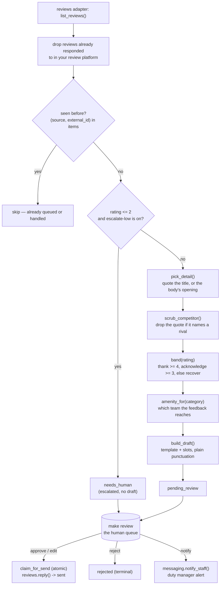

# How it works

Review-Response AI ("The Reputation Knight") watches your review inbox and
drafts a reply to each new review. It never posts on its own. A person
approves, edits or rejects every draft before anything reaches a guest.

## The central design choice: no LLM writes a word a guest sees

The reply itself is built from a **template plus the review's own text** —
not a model. Given the same review and the same rule settings, you get the
same draft every time, and you can explain any draft in one sentence: *"5
stars, thank band, quoted the title, signed because brand-voice is on."*

This is deliberate, not a shortcut. A hotel needs to trust *why* a reply says
what it says, and a rule toggle needs to visibly change the outcome so you can
tell it is doing something. Three fixed templates (thank / acknowledge /
recover) and five on/off rules do that; an LLM call in the loop would not.

The only place a model appears is the optional morning note
(`tools/narrate.py`) — one cosmetic paragraph that summarises a finished run
for a person. It never sees a guest, and it never touches a draft. It is off
by default (see "Design decisions" below).

## The loop

Every box left of the queue runs in `tools/engine.py` and is a pure function
over plain data — no I/O, so every rule is a unit test (`tests/`). Every box
right of the queue is a write, and every write goes through
`core/review.py:assert_write_allowed` — shadow mode blocks all of them until a
human approves.

## What runs when

| Step | Workflow | Cadence | Talks to |
|---|---|---|---|
| Fetch + draft | `workflows/10-review-response.md` (`make run`) | every 4 hours (recommended — see "the 24-hour promise" below) | reviews adapter |
| Human review | `workflows/80-review.md` (`make review`) | daily, or whenever you have five minutes | — |
| Post approved replies | `python3 tools/review.py post` | after each review session | reviews adapter (write) |
| Morning note (optional) | `python3 tools/narrate.py` | once a day, if `narrate.enabled: true` | LLM provider |
| Benefit numbers | `python3 tools/report.py` | weekly, or before a call with your GM | — |

## Modes

`mode: shadow` (default) drafts and queues everything; nothing is posted.
`mode: live` lets `python3 tools/review.py post` really call `reviews.reply()`
— but only for items a human already approved or edited. There is no
autonomous "auto-post" path anywhere in this repo, for any star rating: see
`docs/safety.md`.

## Data model

One table, no extras: `items` (from `core/store.py`), `kind="review"`,
`source` = the platform (`google`, `booking.com`, `tripadvisor`, `vrbo`, or
whatever you configure), `external_id` = the platform's review id.

- `payload` — the review as the adapter returned it: rating, guest name,
  title, body, category, review date, and whether the platform already shows
  it as responded to.
- `intent` — the band the reply landed in (`thank`, `acknowledge`, `recover`),
  or `escalated` when the escalation gate fired.
- `draft` — `{body, band, detail, scrubbed, amenity, signed}` once drafted.
- `review_status` — the shared FSM in `core/store.py`. Escalated reviews start
  at `needs_human`; drafted ones at `pending_review`.

No new SQL tables. The five reputation rules and the escalation reason are
config and code, not database rows — see "Design decisions" below for why.

## Idempotency

- `(source, external_id)` is unique on `items` (core/store.py), so re-running
  `make run` on the same fetch never redrafts a review you have already
  queued or posted.
- A review the platform already shows as `responded` is dropped before it
  ever reaches the store — it was answered outside this agent (by you, before
  you installed it, or by hand) and is never touched.
- Posting uses `store.claim_for_send()`, an atomic conditional UPDATE, so two
  overlapping runs of `python3 tools/review.py post` can never post the same
  reply twice.
- `make demo` runs on its own database (`data/demo/demo.db`) and never
  touches `data/agent.db`, so it is safe to run repeatedly and always shows
  the same bundled reviews.

## Design decisions (the spec left these open)

The behavioural spec this repo was built from documents several points the
original demo left unresolved. Decisions taken here, and why:

1. **Platforms: Google, Booking.com, TripAdvisor, Vrbo.** The product roster
   promises these four; the demo product it was extracted from actually
   listed Expedia instead of Vrbo. This repo follows the roster, since that is
   the promise a hotel is shown. Change `platforms:` in `config/agent.yaml` to
   whatever you actually use — nothing in the code assumes a specific list.
2. **No booking-context lookup.** The roster says replies "pull in booking
   context"; the underlying logic never reads a reservation record — a
   drafted reply uses only the review's own text. This repo keeps that
   honestly: there is no PMS adapter here at all (see `docs/integrations.md`).
   If you want a draft to mention "your stay in Room 12", that is a genuine
   feature to add, not a flag to flip.
3. **Reviews adapter: `mock` and `csv` ship; real platform posting is a
   stub.** No review platform's write API is implemented. `mock` (fixtures)
   and `csv` (read a CSV export, log replies for you to paste in by hand) are
   what is actually working. See `docs/integrations.md` for the honest
   status table and the recipe for adding a real one.
4. **Templates stay deterministic.** The alternative — an LLM writing the
   reply — was explicitly considered and rejected for this repo, for the
   reason in the first section above. If you want more variety at volume than
   three fixed templates give you, that is a real redesign (prompts + a
   validation gate re-implementing every guardrail below in the prompt),
   not a config change.
5. **The five toggles are `config/agent.yaml` booleans, not a database
   table.** The original product stored them as rows so a dashboard could
   flip them live. This repo has no dashboard — editing the YAML file and
   re-running is the equivalent action, and it is one file to read to see
   every rule that can change a reply.
6. **The "within 24 hours" promise has no clock built in.** The `same-day`
   rule only changes the explanatory text in the run summary; nothing pages
   anyone about an ageing review. What actually delivers same-day coverage is
   how often you schedule `make run` — see `make schedule` and the cadence
   table above. Say this plainly to a hotel: the promise is a scheduling
   choice, not a feature this code turns on by itself.
7. **Missing `category` falls back to "the team".** If an inbound review has
   no theme, `amenity_for(None)` returns the generic `amenities.default`
   value rather than failing the run.
8. **English only.** No language detection or translation step. A review in
   another language gets an English reply built from the same templates.
   Worth fixing before relying on this for a property with many non-English
   guests.
9. **Edited drafts are recorded, not learned from.** `core/review.py:edit()`
   already writes every human correction to the `learnings` table for free.
   This agent has no weekly coach pass reading them (the roster does not list
   it under the Coach's applies-to), so nothing acts on them yet — they are
   there if you want to build that later.
10. **"Won't auto-publish negative-review replies without approval" holds for
    every star rating, not just low ones.** The escalation gate sits at 2
    stars and below; a 3-star "acknowledge" reply is still draftable. But
    posting *any* draft — 5 stars or 2 — always requires a human "approve"
    first, because `reviews.reply()` is a guarded write and `publish` is in
    `review.require_approval_for` by default. The roster promise is kept by
    the write guard, not by the star threshold.
11. **No em dashes in reply text.** The original template wording used a few;
    this repo's copy carries the same meaning with plain punctuation, per the
    house style for guest-facing text (see `docs/safety.md`).

## Sub-agents and the coach layer

None. This repo is one agent, one loop, no folded children, and no weekly
coach pass (see decision 9 above).
